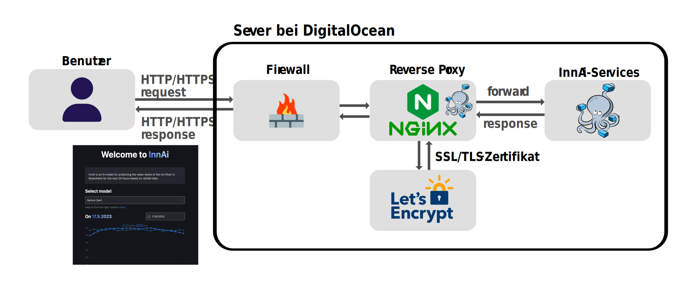

# InnAi Production 🚀

Visit Website of InnAi 👉 <a href="https://innai.de">here</a> 👈

## What is InnAi 🌊
InnAI is an attempt to predict water level values using precipitation data with a neural network.

## All InnAi Projects
<table>
    <tr>
        <th>Model</th>
        <th>Link</th>
        <th>Short description</th>
    </tr>
    <tr>
        <th>InnAi-Train 🏃</th>
        <td><a href="https://github.com/bauerjakob/innai-train">Click here to open</a> 👈</td>
        <td>AI models are trained there, and training data is prepared there.</td>
    </tr>
    <tr>
        <th>InnAi-Predict 🎯</th>
        <td><a href="https://github.com/bauerjakob/innai-predict">👉 Click here to open</a></td>
        <td>Website for displaying and comparing results, with a server featuring a REST interface for data provision.</td>
    </tr>
    <tr>
        <th>InnAi-Production 🚀</th>
        <td>You are here 🏆</td>
        <td>Deployment of reverse proxy and services.</td>
    </tr>
</table>

## Overview

    

